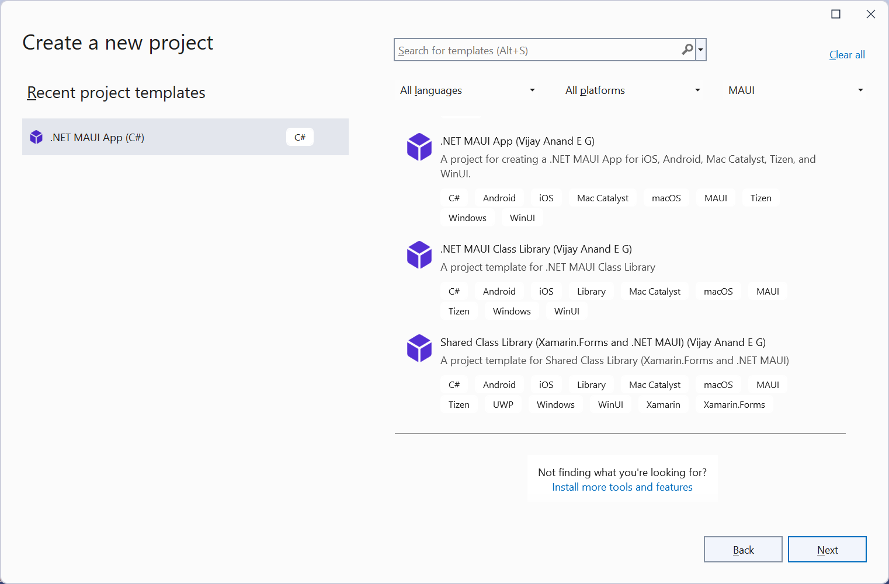
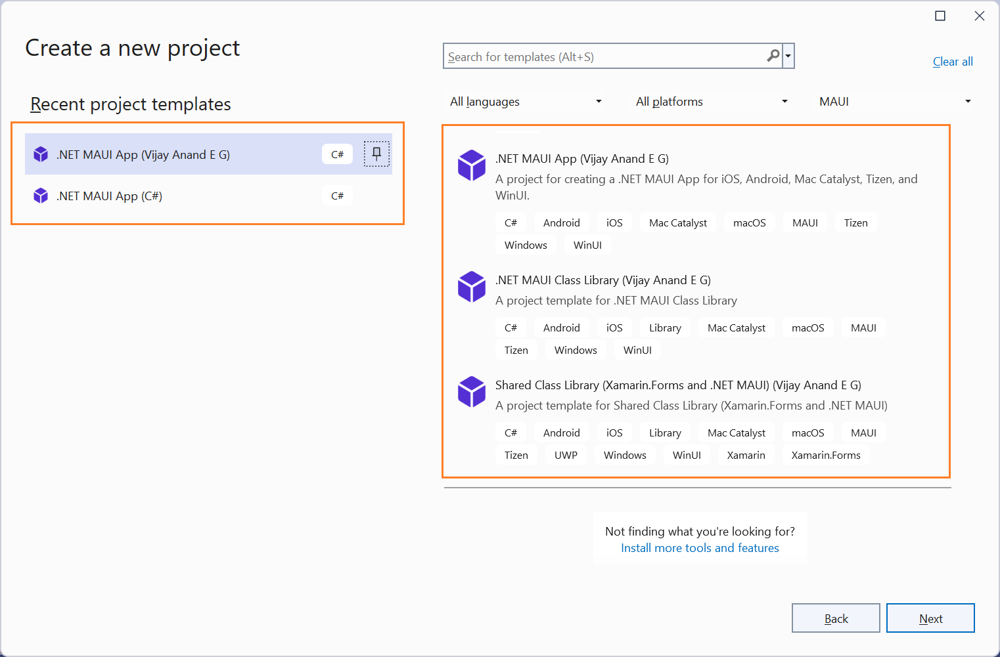

## .NET MAUI Project and Item Templates
This repository is to host the .NET MAUI Project Templates, Item Templates and Code Snippets.

Join me on [**Developer Thoughts**](https://egvijayanand.in/ "Developer Thoughts"), an exclusive blog for .NET MAUI and Blazor, for articles on working with these templates and much more.

We all know that .NET MAUI is an evolution of Xamarin.Forms.

On the Release channel, `.NET MAUI SR6 (Service Release 6)` is now released on Tue, Oct 11, 2022 along with VS2022 17.3.6

And on the Preview channel, `.NET MAUI 7.0.0-rc.2.6866 (.NET 7 RC2)` is now released on Tue, Oct 18, 2022 along with VS2022 17.4 Preview 4.0

Templates have been updated to support both the release and preview channel and is available to install from.

|NuGet|VS Marketplace|
|:---:|:---:|
|[](https://www.nuget.org/packages/VijayAnand.MauiTemplates/)|[](https://marketplace.visualstudio.com/items?itemName=egvijayanand.maui-templates)|

### For VS2022 users:

To provide an integrated experience, a VS extension has been developed to host these templates.

Extension is made available in the [Visual Studio Marketplace](https://marketplace.visualstudio.com/items?itemName=egvijayanand.maui-templates ".NET MAUI Templates Pack") and even more easier, can be installed from within Visual Studio itself (Extensions -> Manage Extensions / Alt + X + M).


This has Project Templates for:

* .NET MAUI App - An All-in-One .NET MAUI App Project Template - For more details, check out this [article](https://egvijayanand.in/all-in-one-dotnet-maui-app-project-template/ "All-in-One .NET MAUI App Project Template")
* .NET MAUI App (C#)
* .NET MAUI Class Library
* Shared Class Library (Xamarin.Forms and .NET MAUI)



And has Item Templates for:

* Content Page (.NET MAUI)
* Content Page (C#) (.NET MAUI)
* Content Page with ViewModel (.NET MAUI)
* Content Page (C#) with ViewModel (.NET MAUI)
  - For both the `Page with ViewModel` templates, ensure only the real page name alone is provided as input like `Settings` as the `Page` and `ViewModel` will be suffixed to it like `SettingsPage` and `SettingsViewModel`. And Page will be generated in the `Views` folder and ViewModel will be generated in the `ViewModels` folder.
  - The ViewModels are generated with the base class titled `BaseViewModel` (implementation left to the user).
  - Recommended to add [CommunityToolkit.Mvvm](https://www.nuget.org/packages/CommunityToolkit.Mvvm), an officially supported NuGet package (currently in preview), to make it easy to work with MVVM design pattern.
  - This MVVM - Made Easy [Part 1](https://egvijayanand.in/2022/04/22/mvvm-made-easy/) and [Part 2](https://egvijayanand.in/2022/05/09/mvvm-made-easy-with-microsoft-mvvm-toolkit-part-2/) articles can help you to get started with this brand-new NuGet package.
* Content View (.NET MAUI)
* Content View (C#) (.NET MAUI)
* Resource Dictionary (.NET MAUI)
* Resource Dictionary (XAML only)(.NET MAUI)
* Shell Page (.NET MAUI)
* Custom View and Handler (Regular) (.NET MAUI)
  - Handler definitions generated in the Platforms folder
* Custom View and Handler (Cond.) (.NET MAUI)
  - Handler definitions generated in the same folder in conditional compilation format
* Custom View and Renderer (Regular) (.NET MAUI)
  - Renderer definitions generated in the Platforms folder
* Custom View and Renderer (Cond.) (.NET MAUI)
  - Renderer definitions generated in the same folder in conditional compilation format
\
&nbsp;
* For Cond. type template to work properly, ensure Conditional Compilation is enabled (mentioned in detail [**here**](https://github.com/egvijayanand/dotnet-maui-templates#conditional-compilation "Conditional Compilation"))

Now VS2022 extension is loaded with 25+ C# and XAML Code Snippets.

XAML Snippets for new Layouts, Gestures, Color, Style.

C# Snippets for Properties such as Attached, Bindable, ViewModel and Comet (MVU design pattern).

Types such as `record` and `record struct`.

Snippets for Method definition, Event Handler definition (async version also).


### .NET CLI Template

For making use of these templates cross-platform, have provided it as .NET CLI template package distributed via NuGet.

[](https://www.nuget.org/packages/VijayAnand.MauiTemplates/)

Install the template package from NuGet with the below command.

```shell
dotnet new install VijayAnand.MauiTemplates
```

If you've already installed this package, then this can be updated to the latest version with the below command.

```shell
dotnet new update --check-only
```
```shell
dotnet new update
```

This comes with with the following templates:

Name | Template Name | Type
:---: | :---: | :---:
.NET MAUI App | mauiapp | Project
.NET MAUI Class Library | mauiclasslib | Project
Shared Class Library | sharedclasslib | Project
ContentPage | maui-page | Item
ContentPage (C#) | maui-page-cs | Item
ContentView | maui-view | Item
ContentView (C#) | maui-view-cs | Item
ResourceDictionary | maui-resdict | Item
ShellPage | maui-shell | Item



#### Parameters:

Starting with [v2.0.0](https://www.nuget.org/packages/VijayAnand.MauiTemplates/2.0.0) of the template package, to effectively support .NET MAUI on both `.NET 6` and `.NET 7`, CLI project templates defines a new parameter named `framework`:

* Framework: (Short notation: `-f`)

  This can take either `net6.0` or `net7.0` as its options (with `net7.0` being the default value, if not provided).

  Examples:

  ```shell
  dotnet new mauiapp --framework net6.0
  ```

  Below command can be simplified to `dotnet new mauiapp` as default value of `framework` parameter is `net7.0`

  ```shell
  dotnet new mauiapp -f net7.0
  ```

In .NET CLI, all of these item templates takes two parameters:

* Name: (Short notation: `-n`)

    The name of the project/page/view to create. _For pages/views, don't need to suffix it with .xaml_, it will get added.

    _If the name parameter is not specified, by default, the **.NET CLI template engine will take the current folder name as the filename** (current behaviour of the templating engine)._

* Namespace: (Short notation: `-na`)

    The namespace for the generated files.

* Now with more options while creating the app or class library project, ability to include NuGet packages on the fly for `CommunityToolkit.Maui`, `CommunityToolkit.Maui.Markup`, `CommunityToolkit.Mvvm` or all.

*Note: Parameter values are case-insensitive.*

Both .NET MAUI *App* and *Class Library* templates take the below optional Boolean parameters to include the officially supported CommunityToolkit NuGet packages:

*Specifying the parameter name, either in short or full notation, implies that it is defined.*

* `-it` | `--include-toolkit` - Default is `false`
* `-im` | `--include-markup` - Default is `false`
* `-imt` | `--include-mvvm-toolkit` - Default is `false`
* `-cc` | `--conditional-compilation` - Default is `false`

For **App** projects targeting `.NET 7`, option to add and configure `Microsoft.Maui.Controls.Maps` NuGet package.

* `-inm` | `--include-maps` - Default is `false`

*Note: If project targets `.NET 6`, selecting the Maps option will NOT have any impact.*

##### Conditional Compilation

And now conditional compilation can be configured so that platform source files can be defined anywhere in the project provided they follow a naming convention as mentioned below. This will allow maintaining related source files in the same place, especially MAUI Handlers.

* \*.Standard.cs - Files targeting the BCL
* \*.Android.cs - Files specific to Android
* \*.iOS.cs - Files shared with both iOS and MacCatalyst
* \*.MacCatalyst.cs - Files specific to MacCatalyst
* \*.Tizen.cs - Files specific to Tizen
* \*.Windows.cs - Files specific to Windows

For existing projects, add the below block of code in the project file (.csproj). _This will modify the behavior of build process so due care must be taken if doing so._

```xml
<ItemGroup Condition="'$(TargetFramework)' != 'net6.0'">
    <Compile Remove="**\*.Standard.cs" />
    <None Include="**\*.Standard.cs" Exclude="$(DefaultItemExcludes);$(DefaultExcludesInProjectFolder)" />
</ItemGroup>

<ItemGroup Condition="$([MSBuild]::GetTargetPlatformIdentifier('$(TargetFramework)')) != 'ios' AND $([MSBuild]::GetTargetPlatformIdentifier('$(TargetFramework)')) != 'maccatalyst'">
    <Compile Remove="**\*.iOS.cs" />
    <None Include="**\*.iOS.cs" Exclude="$(DefaultItemExcludes);$(DefaultExcludesInProjectFolder)" />
    <Compile Remove="**\iOS\**\*.cs" />
    <None Include="**\iOS\**\*.cs" Exclude="$(DefaultItemExcludes);$(DefaultExcludesInProjectFolder)" />
</ItemGroup>

<ItemGroup Condition="$([MSBuild]::GetTargetPlatformIdentifier('$(TargetFramework)')) != 'android'">
    <Compile Remove="**\*.Android.cs" />
    <None Include="**\*.Android.cs" Exclude="$(DefaultItemExcludes);$(DefaultExcludesInProjectFolder)" />
    <Compile Remove="**\Android\**\*.cs" />
    <None Include="**\Android\**\*.cs" Exclude="$(DefaultItemExcludes);$(DefaultExcludesInProjectFolder)" />
</ItemGroup>

<ItemGroup Condition="$([MSBuild]::GetTargetPlatformIdentifier('$(TargetFramework)')) != 'maccatalyst'">
    <Compile Remove="**\*.MacCatalyst.cs" />
    <None Include="**\*.MacCatalyst.cs" Exclude="$(DefaultItemExcludes);$(DefaultExcludesInProjectFolder)" />
    <Compile Remove="**\MacCatalyst\**\*.cs" />
    <None Include="**\MacCatalyst\**\*.cs" Exclude="$(DefaultItemExcludes);$(DefaultExcludesInProjectFolder)" />
</ItemGroup>

<ItemGroup Condition="$([MSBuild]::GetTargetPlatformIdentifier('$(TargetFramework)')) != 'tizen'">
    <Compile Remove="**\*.Tizen.cs" />
    <None Include="**\*.Tizen.cs" Exclude="$(DefaultItemExcludes);$(DefaultExcludesInProjectFolder)" />
    <Compile Remove="**\Tizen\**\*.cs" />
    <None Include="**\Tizen\**\*.cs" Exclude="$(DefaultItemExcludes);$(DefaultExcludesInProjectFolder)" />
</ItemGroup>

<ItemGroup Condition="$([MSBuild]::GetTargetPlatformIdentifier('$(TargetFramework)')) != 'windows'">
    <Compile Remove="**\*.Windows.cs" />
    <None Include="**\*.Windows.cs" Exclude="$(DefaultItemExcludes);$(DefaultExcludesInProjectFolder)" />
    <Compile Remove="**\Windows\**\*.cs" />
    <None Include="**\Windows\**\*.cs" Exclude="$(DefaultItemExcludes);$(DefaultExcludesInProjectFolder)" />
</ItemGroup>
```

All-in-One .NET MAUI App project takes one additional parameter to define the application design pattern:

* `-dp` | `--design-pattern`

Can take any one of the following values, with default value set to `Plain`:

|Parameter Value|Description|
|:---:|:---|
|Plain|App configured to work with a single, initial screen.|
|Hierarchical|App configured to work in a Hierarchical pattern using NavigationPage.|
|Tab|App configured to work in a Tabbed fashion using TabbedPage.|
|Shell|App configured to work with Routes using Shell page.|
|Hybrid|App configured to work in a Hybrid fashion using BlazorWebView.|

Shared Class Library template take the below optional Boolean parameters to include the officially supported NuGet packages:

*Specifying the parameter name, either in short or full notation, implies that it is defined.*

Single parameter to include all the supported NuGet packages:

* `-asp` | `--all-supported-packages` - Default is `false`

Specific to `Xamarin.Forms`:

* `-ife` | `--include-forms-essentials` - Default is `false`
* `-ift` | `--include-forms-toolkit` - Default is `false`
* `-ifm` | `--include-forms-markup` - Default is `false`

Specific to `.NET MAUI`:

* `-imt` | `--include-maui-toolkit` - Default is `false`
* `-imm` | `--include-maui-markup` - Default is `false`

Common to both:

* `-inmt` | `--include-mvvm-toolkit` - Default is `false`

For more details: run this command in the terminal (use `-h` to save some keystrokes):

```shell
dotnet new mauiapp --help
```
```shell
dotnet new mauiclasslib --help
```
```shell
dotnet new sharedclasslib --help
```

#### Usage:

After installation, use the below command(s) to create new artifacts using the template (both provide the same output):

With parameter names abbreviated:


.NET MAUI App:
```shell
dotnet new mauiapp -n MyApp -dp Hybrid
```
Option to include NuGet packages:
```shell
dotnet new mauiapp -n MyApp -dp Shell -it -im -imt
```
Option to configure conditional compilation:
```shell
dotnet new mauiapp -n MyApp -dp Shell -cc
```

.NET MAUI Class Library:
```shell
dotnet new mauiclasslib -n MyApp.Core
```
Option to include NuGet packages:
```shell
dotnet new mauiclasslib -n MyApp.Core -it -im -imt
```
Option to configure conditional compilation:
```shell
dotnet new mauiclasslib -n MyApp.Core -cc
```

Shared Class Library:
```shell
dotnet new sharedclasslib -n MyApp.UI
```
Option to include all supported NuGet packages:
```shell
dotnet new sharedclasslib -n MyApp.UI -asp
```

Pages:
```shell
dotnet new maui-page -n LoginPage -na MyApp.Views
```
```shell
dotnet new maui-page-cs -n HomePage -na MyApp.Views
```

Views:
```shell
dotnet new maui-view -n CardView -na MyApp.Views
```
```shell
dotnet new maui-view-cs -n OrderView -na MyApp.Views
```

Shell:
```shell
dotnet new maui-shell -n AppShell -na MyApp
```

Resource Dictionary:
```shell
dotnet new maui-resdict -n LightTheme -na MyApp.Themes
```

With parameter names expanded:

.NET MAUI App:
```shell
dotnet new mauiapp --name MyApp --design-pattern Hybrid
```
Option to include NuGet packages:
```shell
dotnet new mauiapp --name MyApp --design-pattern Shell --include-toolkit --include-markup --include-mvvm-toolkit
```
```shell
dotnet new mauiapp -n MyApp --design-pattern Shell --conditional-compilation
```

.NET MAUI Class Library:
```shell
dotnet new mauiclasslib --name MyApp.Core
```
```shell
dotnet new mauiclasslib --name MyApp.Core --include-toolkit --include-markup --include-mvvm-toolkit
```
```shell
dotnet new mauiclasslib --name MyApp.Core --conditional-compilation
```

Shared Class Library:
```shell
dotnet new sharedclasslib --name MyApp.UI
```
```shell
dotnet new sharedclasslib --name MyApp.UI --all-supported-packages
```

Pages:
```shell
dotnet new maui-page --name LoginPage --namespace MyApp.Views
```
```shell
dotnet new maui-page-cs --name HomePage --namespace MyApp.Views
```

Views:
```shell
dotnet new maui-view --name CardView --namespace MyApp.Views
```
```shell
dotnet new maui-view-cs --name OrderView --namespace MyApp.Views
```

Shell:
```shell
dotnet new maui-shell --name AppShell --namespace MyApp
```

Resource Dictionary:
```shell
dotnet new maui-resdict --name LightTheme --namespace MyApp.Themes
```
<!--
### For VS2019 users:

Now, ContentPage is completely moved into .NET MAUI world with a brand new xml namespace and using directive.

So that the existing Xamarin.Forms item templates cannot be used as is from now on and modifying it every time is painful.

Hence have created a VS extension exclusively to be used with .NET MAUI projects.

Grab these templates from the [Visual Studio Marketplace](https://marketplace.visualstudio.com/items?itemName=egvijayanand.maui-item-templates) and even more easier, can be installed from within Visual Studio itself (Extensions -> Manage Extensions / Alt + X + M)

This has a Project Template for:

* .NET MAUI Class Library (Preview 10)

And has Item Templates for:

* Content Page (.NET MAUI)
* Content Page (C#) (.NET MAUI)
* Content View (.NET MAUI)
* Content View (C#) (.NET MAUI)
* Resource Dictionary (.NET MAUI)
* Shell Page (.NET MAUI)


-->
