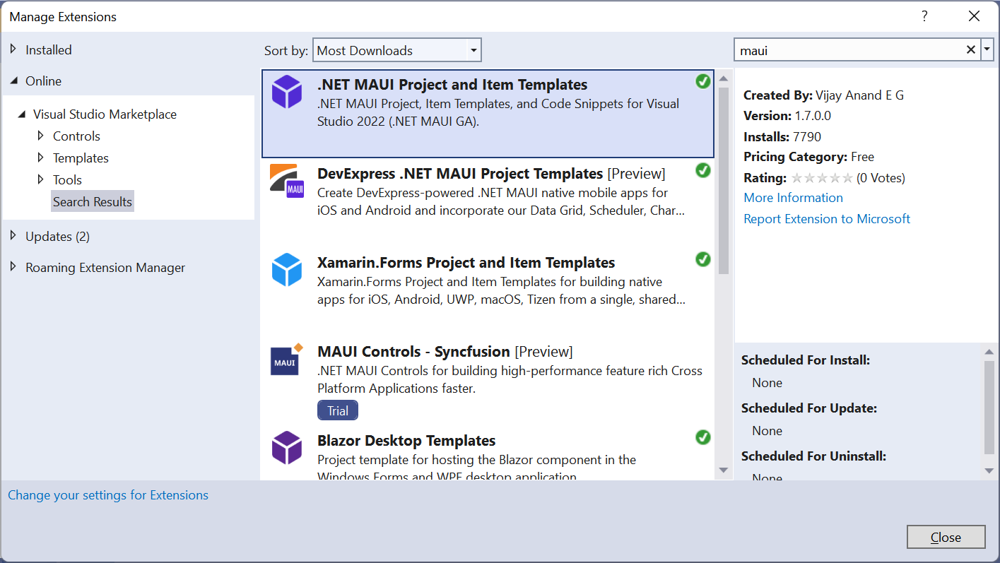

## .NET MAUI Project and Item Templates
This repository is to host the .NET MAUI Project and Item templates and Code Snippets.

We all know that .NET MAUI is an evolution of Xamarin.Forms.

And now, .NET MAUI Preview 10 released on Mon, Nov 8, 2021 along with VS2022 Preview 1.0 (17.1.0)

Templates have been updated to support the latest release.

### For VS2022 users:

To provide an integrated experience, a VS extension has been developed to host these templates.

Extension is made available in the [Visual Studio Marketplace](https://marketplace.visualstudio.com/items?itemName=egvijayanand.maui-templates) and even more easier, can be installed from within Visual Studio itself (Extensions -> Manage Extensions / Alt + X + M).



This has Project Templates for:

* .NET MAUI App (Preview 10)
* .NET MAUI App (C#) (Preview 10)
* .NET MAUI Blazor App (Preview 10)
* .NET MAUI Class Library (Preview 10)


And has Item Templates for:

* Content Page (.NET MAUI)
* Content Page (C#) (.NET MAUI)
* Content View (.NET MAUI)
* Content View (C#) (.NET MAUI)
* Resource Dictionary (.NET MAUI)
* Shell Page (.NET MAUI)

Now VS2022 extension is loaded with 25+ C# and XAML Code Snippets.

XAML Snippets for new Layouts, Gestures, Color, Style.

C# Snippets for Properties such as Attached, Bindable, ViewModel and Comet (MVU design pattern).

Types such as `record` and `record struct`.

Snippets for Method definition, Event Handler definition (async version also).


### For VS2019 users:

Now, ContentPage is completely moved into .NET MAUI world with a brand new xml namespace and using directive.

So that the existing Xamarin.Forms item templates cannot be used as is from now on and modifying it every time is painful.

Hence have created a VS extension exclusively to be used with .NET MAUI projects.

Grab these templates from the [Visual Studio Marketplace](https://marketplace.visualstudio.com/items?itemName=egvijayanand.maui-item-templates) and even more easier, can be installed from within Visual Studio itself (Extensions -> Manage Extensions / Alt + X + M)

This has a Project Template for:

* .NET MAUI Class Library (Preview 10)

And has Item Templates for:

* Content Page (.NET MAUI)
* Content Page (C#) (.NET MAUI)
* Content View (.NET MAUI)
* Content View (C#) (.NET MAUI)
* Resource Dictionary (.NET MAUI)
* Shell Page (.NET MAUI)


### .NET CLI Template

For making use of these templates cross-platform, have provided it as .NET CLI template package distributed via NuGet.

[](https://www.nuget.org/packages/VijayAnand.MauiTemplates/)

Install the template package from NuGet with the below command.

```shell
dotnet new --install VijayAnand.MauiTemplates
```

If you've already installed this package, then this can be updated to the latest version with the below command.

```shell
dotnet new --update-check
dotnet new --update-apply
```

This comes with with the following templates:

Type | Template Name
:---: | :---:
.NET MAUI Class Library | mauiclasslib
ContentPage | maui-page
ContentView | maui-view
ShellPage | maui-shell

#### Parameters:

In .NET CLI, all of these templates takes two parameters:

* Name: (Short notation: `-n`)

    The name of the project/page/view to create. _For pages/views, don't need to suffix it with .xaml_, it will get added.

    _If the name parameter is not specified, by default, the **.NET CLI template engine will take the current folder name as the filename** (current behaviour of the templating engine)._

* Namespace: (Short notation: `-na`)

    The namespace for the generated files.

#### Usage:

After installation, use the below command(s) to create new artifacts using the template (both provide the same output):

With parameter names abbreviated:

```shell
dotnet new mauiclasslib -n MyApp.Core
```

```shell
dotnet new maui-page -n LoginPage -na MyApp.Views
```

```shell
dotnet new maui-view -n CardView -na MyApp.Views
```

```shell
dotnet new maui-shell -n AppShell -na MyApp
```

With parameter names expanded:

```shell
dotnet new mauiclasslib --name MyApp.Core
```

```shell
dotnet new maui-page --name LoginPage --namespace MyApp.Views
```

```shell
dotnet new maui-view --name CardView --namespace MyApp.Views
```

```shell
dotnet new maui-shell --name AppShell --namespace MyApp
```
